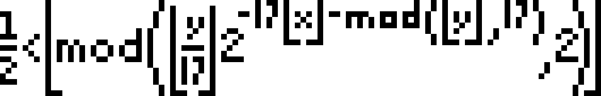

# Self Referential Formula
 Formula that draws every possible bitmap image of size 106x17px

# Instructions
Run program with `python main.py <offset>`

The formula draw itself when the offset is equal to 
> 960939379918958884971672962127852754715004339660129306651505519271702802395266424689642842174350718121267153782770623355993237280874144307891325963941337723487857735749823926629715517173716995165232890538221612403238855866184013235585136048828693337902491454229288667081096184496091705183454067827731551705405381627380967602565625016981482083418783163849115590225610003652351370343874461848378737238198224849863465033159410054974700593138339226497249461751545728366702369745461014655997933798537483143786841806593422227898388722980000748404719

### Why does this work?
The offset is multiplied by 106x17 (number of bits/pixels the image consists of). When the offset is 0, the program draws the number 0 in base 2. The same happens with every value n. To find the offset that draws the formula, one only needs to draw the image you want, convert it to a binary value and input that as an offset. 

The binary number starts with the least significant bit in the bottom right corner. When the bit to be turned on is beyond the left edge, the leftmost pixel on line 2 from the bottom represents it. This wrapping happens to every line.

The program is inspired by Matt Parker and his book "Things to Make and Do in The Fourth Dimension"

### Support me: 

